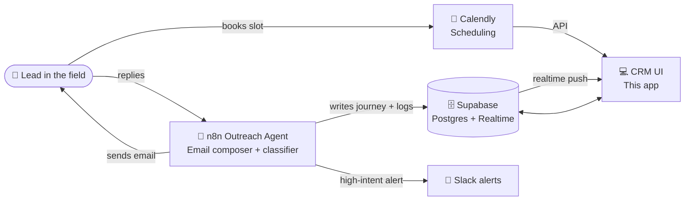
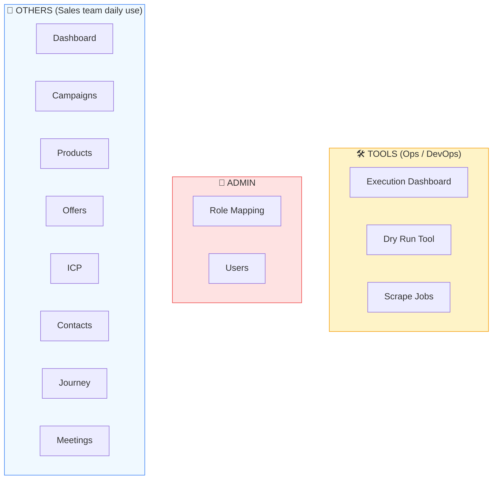
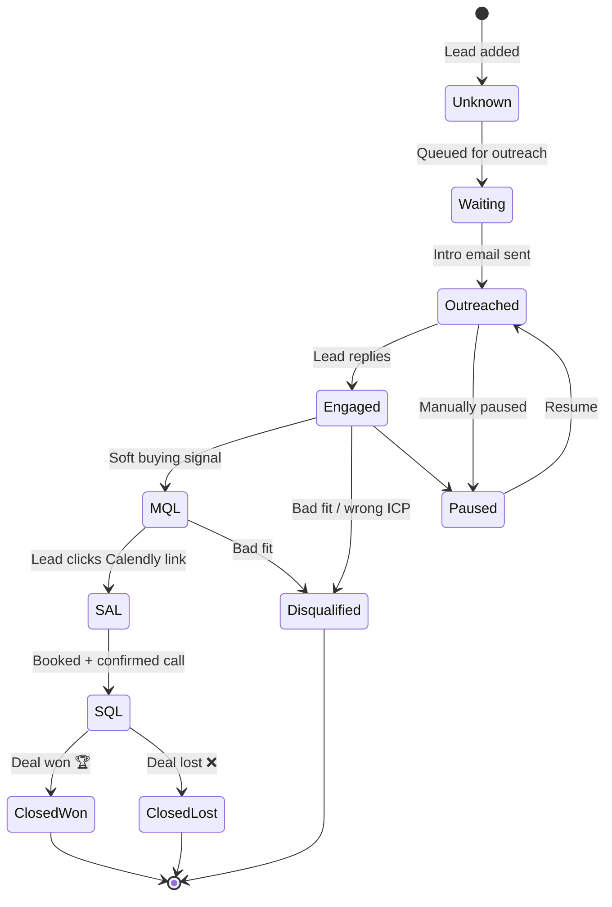
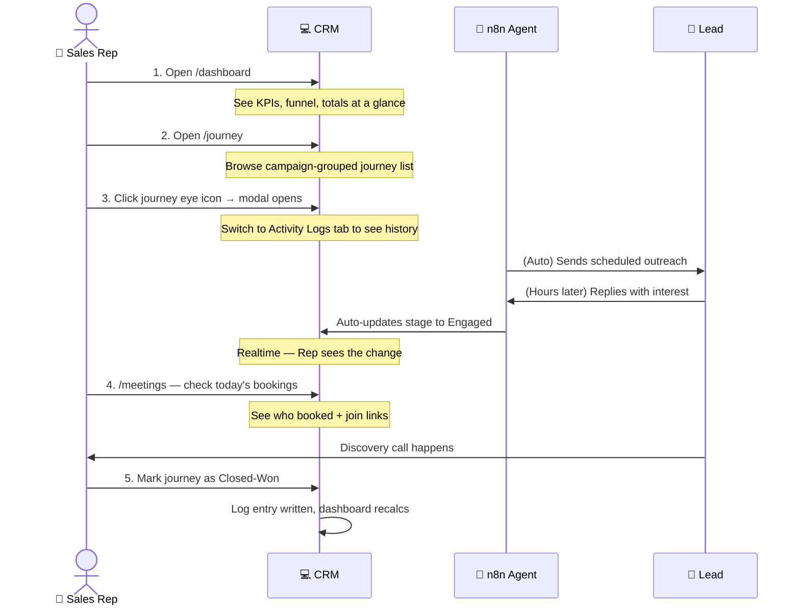
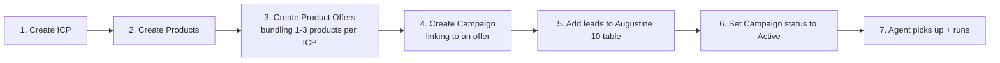
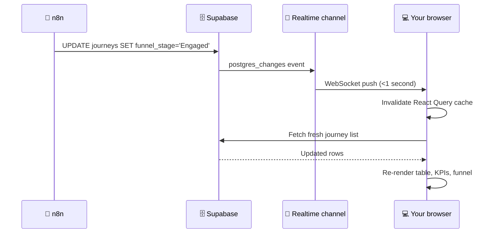

# Augustine CRM — How to Use the System

**Audience:** Sales reps, sales managers, ops admins, and anyone using the CRM day-to-day.
**Companion doc:** [DELIVERY-SUMMARY.md](./DELIVERY-SUMMARY.md) for the feature inventory.

---

## Table of Contents

1. [The big picture — how everything fits together](#1-the-big-picture)
2. [Navigation map — where to click for what](#2-navigation-map)
3. [The lead journey lifecycle](#3-the-lead-journey-lifecycle)
4. [Day in the life of a sales rep](#4-day-in-the-life-of-a-sales-rep)
5. [Day in the life of an admin](#5-day-in-the-life-of-an-admin)
6. [Common tasks — cheat sheet](#6-common-tasks)
7. [How real-time updates work](#7-real-time-updates)
8. [Troubleshooting](#8-troubleshooting)

---

## 1. The big picture

The CRM is the **dashboard you see**, but four systems work together behind it. Knowing where each one lives makes troubleshooting and feature requests easier.



**Plain English version:**

- **n8n** does the actual outreach — composes the emails, sends them, reads replies, and classifies what stage each lead is in.
- **Supabase** is the database that stores everything (campaigns, leads, journeys, activity logs).
- **Calendly** owns the calendar; leads book directly into it.
- **The CRM (this app)** is the lens — it reads everything from Supabase and Calendly in real time, and lets your team take manual actions when needed.
- **Slack** receives high-intent alerts from the agent.

You **do not** edit campaigns / outreach copy in n8n — you do it in the CRM, and the agent picks up the new configuration on its next run.

---

## 2. Navigation map

The sidebar is grouped by audience:



| Section | Who uses it | Frequency |
|---|---|---|
| **Dashboard** | Everyone — open it first thing in the morning | Daily |
| **Journey** | Sales reps — track funnel progression | Multiple times a day |
| **Meetings** | Sales reps — see upcoming booked calls | Daily |
| **Contacts** | Sales reps — look up specific leads | As needed |
| **Campaigns** | Sales managers / admins — manage what's running | Weekly |
| **Products / Offers / ICP** | Admins / ops — set up the catalog and audience definitions | Monthly / quarterly |
| **Tools** | DevOps / ops — pipeline monitoring & data scraping | Setup + ad-hoc debugging |
| **Admin** | Workspace admin only | Onboarding new users |

---

## 3. The lead journey lifecycle

Every lead in the CRM is a **journey** — a single record that tracks their progress through one campaign. A journey moves through these stages:



**Stage definitions:**

| Stage | Meaning | Who moves it |
|---|---|---|
| `Unknown` | Lead just created, not yet processed | n8n (auto) |
| `Waiting` | In queue for outreach | n8n (auto) |
| `Outreached` | Intro email sent | n8n (auto) when first email lands |
| `Engaged` | Lead replied | n8n (auto) classifies positive reply |
| `MQL` | Marketing Qualified — soft buying signal | n8n (auto) |
| `SAL` | Sales Accepted — explicitly clicked Calendly link | n8n (auto) on Calendly click |
| `SQL` | Sales Qualified — booked + confirmed | Manual / Calendly webhook |
| `Closed-Won` | Deal closed positively | **Sales rep (manual button)** |
| `Closed-Lost` | Deal closed negatively | **Sales rep (manual button)** |
| `Disqualified` | Not a fit (wrong ICP, no budget, etc.) | n8n (auto) or manual |
| `Paused` | Outreach temporarily halted | Manual |

Most stages flip **automatically** based on the agent's reading of the lead's behaviour. The two terminal stages **Closed-Won** and **Closed-Lost** are decided by the sales rep using the manual button (see [Section 6 — Mark Won / Lost](#6-common-tasks)).

---

## 4. Day in the life of a sales rep

Here's a typical workday using the CRM:



**Step-by-step:**

1. **Morning check-in** — Open Dashboard (`/dashboard`). Glance at:
   - Total Journeys count (real-time)
   - Funnel breakdown — which stages have what counts
   - Conversion rate trend
2. **Triage the funnel** — Open Journey (`/journey`). Use the filters to focus on what matters today (e.g., Stage = `SAL` shows hot leads who clicked the booking link).
3. **Drill into a specific journey** — Click the eye icon on any row. The Details tab shows everything about the lead; the Activity Logs tab shows the email/reply history with timestamps.
4. **Check upcoming meetings** — Open Meetings (`/meetings`). The Today section shows what's on your calendar for the day; click Join when it's time.
5. **Close out won deals / lost deals** — After a call, open the journey modal → Mark Journey Outcome section → click Mark as Closed-Won (or Closed-Lost with reason). The funnel and dashboard update instantly.

---

## 5. Day in the life of an admin

Admins handle setup and ongoing maintenance.

### Initial setup (one-time)



1. **Define your ICPs** (`/icp`) — describe the customer profiles you want to target.
2. **Add Products** (`/products`) — the things you sell, each with a pricing type and price.
3. **Build Product Offers** (`/product-offers`) — bundle 1–3 products together for a specific ICP. Slot 1 is the primary pitch; Slots 2 and 3 are upsell / cross-sell.
4. **Create a Campaign** (`/campaigns`) — give it a name, link it to a Product Offer, and write the **instructions** (tone, audience focus, any Slack alert rules, scheduling link rules).
5. **Add leads** to the leads table — usually a CSV import or sync from HubSpot.
6. **Flip the Campaign to Active** — within ~10 minutes the n8n agent picks it up, starts queuing leads matching the offer's ICP, and begins outreach.

### Ongoing weekly work

- **Monitor campaign performance** in `/campaigns` — watch the status badges (Draft / Active / Running / Stopped).
- **Review the journey funnel** in `/journey` — make sure stages are advancing, look for stuck leads.
- **Tweak campaign instructions** if conversion is poor — edit the campaign, the agent will pick up the new instructions on its next run.
- **Pause / Stop campaigns** that have run their course.
- **Clean up dead journeys** when a lead is no longer reachable — use the trash icon on the journey row.

---

## 6. Common tasks

### How do I launch a new campaign?

```
1. /icp           → Create or pick an ICP for the audience
2. /product-offers → Make sure there's an offer targeting that ICP
3. /campaigns     → Click "Create Campaign"
                    - Name: descriptive (e.g. "Q2 Parish Outreach")
                    - Offer: pick the one you made
                    - Instructions: tone + Slack alert rules
                    - Status: leave as Draft to review, or Active to launch immediately
4. Within ~10 minutes the n8n agent picks it up.
5. First email drops → status auto-flips to "Running"
```

### How do I find a specific lead?

- **By parish name** — `/journey` → search box at the top
- **By contact info** — `/contacts` → search or scroll
- **By campaign** — `/journey` → filter by Campaign dropdown
- **By stage** — `/journey` → filter by Stage dropdown

### How do I mark a journey as Won or Lost?

```
1. /journey → find the journey
2. Click the 👁 (eye) icon to open the detail modal
3. Scroll to "Mark Journey Outcome" section
4. Click "Mark as Closed-Won" (green) or "Mark as Closed-Lost" (red)
5. In the confirmation dialog:
   - For Won: optionally add a context note (e.g., "Signed contract today")
   - For Lost: pick a reason (Budget, Timing, Not a fit, etc.) — required
6. Click "Confirm"
```

The journey's stage flips immediately, a log entry is written, and the dashboard counts update in real time.

### How do I see today's meetings?

```
/meetings → "Upcoming" tab is selected by default

Today's bookings appear under a "TODAY" pill heading.
Click the green Join button on the right to open the meeting URL.
Click anywhere else on the row to see invitee details.
```

### How do I check what the agent has been doing on a specific lead?

```
/journey → find the lead's journey
Click the 🟢 (green Activity icon) — opens the modal directly on the Logs tab
You'll see every email sent, every reply, every stage change, every manual action,
in chronological order with timestamps and stage badges.
```

### How do I delete a duplicate journey?

```
/journey → find the duplicate row inside its campaign accordion
Click the red 🗑 (trash icon) in the actions cell
Confirm in the dialog → the journey row is deleted (and its dependent logs)

The lead and campaign themselves are NOT affected — only this single journey record.
```

### How do I stop a campaign?

```
/campaigns → find the row
Click the status dropdown (currently shows "Running" or "Active")
Pick "Stopped"
Confirm in the dialog

The agent will stop processing this campaign on its next run cycle (~10 min).
Existing in-flight emails already sent will still be tracked.
```

### How do I delete a campaign and everything under it?

```
/campaigns → click the red 🗑 trash icon on the row
The hard-delete dialog opens explaining:
  - The campaign itself will be removed
  - All journeys under it will be deleted
  - All outreach logs tied to those journeys will be deleted
Type "DELETE" into the input box (required) to enable the Confirm button
Click "Delete permanently"

This is a cascade — there is no undo. Use Stop instead if you might want the campaign back.
```

---

## 7. Real-time updates

One of the biggest wins of the new system is **everything updates without refreshing**. Here's how:



**What this means in practice:**

- When n8n sends an email and updates a journey, your CRM tab refreshes that row automatically — **no F5 needed**.
- If two team members are looking at the same campaign, and one of them marks a journey as Won, the other sees it flip on their screen within a second.
- The Activity Logs tab is a live feed — when the agent writes a new log entry, it appears at the top of the timeline.

**Currently real-time:**
- ✅ Journey table + filters
- ✅ Journey detail modal
- ✅ Activity Logs tab
- ✅ Campaigns list
- ✅ Dashboard KPI tiles + funnel chart

**Currently polling (refreshes every 30s):**
- 🔄 Meetings page (Calendly API doesn't push, we poll)

---

## 8. Troubleshooting

### Numbers don't match between Dashboard and Journey page

This usually means **stale React Query cache**. Try:
1. Refresh the browser
2. If the difference persists, run the diagnostic in [docs/DELIVERY-SUMMARY.md](./DELIVERY-SUMMARY.md) action items section

If you see this regularly, it's almost certainly orphaned journeys (journeys pointing to leads that were deleted). Ask the engineering team to run the orphan cleanup SQL.

### "This page encountered an error" screen

Click **Retry** first. If the error persists:
1. Open browser devtools console (F12 → Console tab)
2. Copy the error message
3. Send it to the engineering team — they can usually pinpoint the fix in minutes

### Meetings page shows "Calendly is not connected yet"

Engineering needs to set the `CALENDLY_API_TOKEN` environment variable on the server. Once set + server restarted, real Calendly bookings appear in seconds.

### I marked a journey as Closed-Won but it's still showing as the old stage

- The page might be using cached data — refresh.
- If it persists after refresh, there's a bigger issue. Send the journey ID to engineering.
- **Note:** marking won/lost is **not reversible from the UI** by design — it locks the journey. Reopening requires admin / direct DB access.

### A campaign is stuck in "Running" forever

There's currently no automatic rule for ending a campaign — manually flip it to "Stopped" from the status dropdown. (Auto-completion when all journeys are terminal is on the roadmap, pending client decision.)

### I deleted the wrong campaign

**There is no undo.** The hard-delete dialog and the "type DELETE to confirm" requirement exist precisely to prevent this. If you genuinely deleted something by accident, contact engineering immediately — they may be able to restore from the most recent Supabase backup, but data created since that backup will be lost.

---

## Need help?

- For **how-to questions:** revisit this doc, or check [docs/DELIVERY-SUMMARY.md](./DELIVERY-SUMMARY.md)
- For **bugs:** screenshot + console error → engineering team
- For **feature requests:** product team or workspace admin
- For **agent / pipeline issues** (emails not sending, wrong stage classifications): the n8n workflow logs are the source of truth; engineering can pull those for you

---

**Last updated:** 2026-05-21
